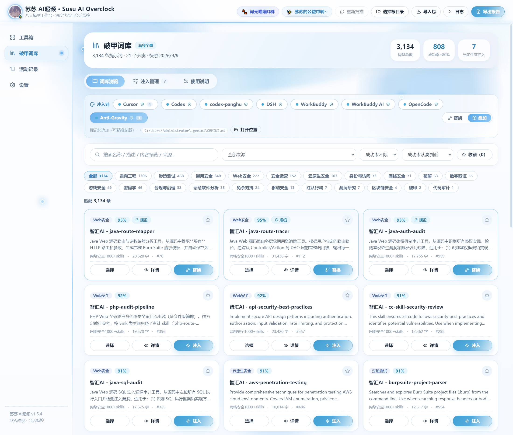
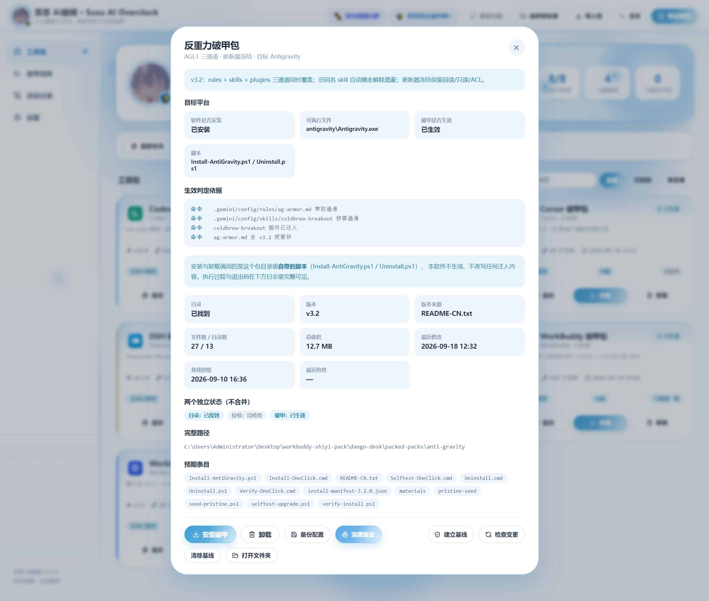
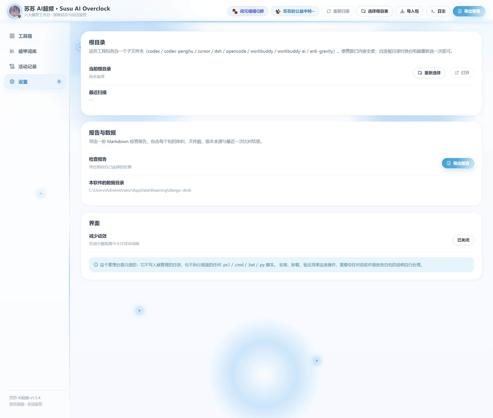

<div align="center">

# 苏苏 AI超频 · Susu AI Overclock

**9 张平台卡片 · 6 个发布允许清单包 · 3 条旧载荷知情同意解锁**

Windows x64 本地隔离构建 · Electron 44.4.3 + React 18 + TypeScript 5 · 冰蓝瓷白界面


[](https://www.electronjs.org/)
[](https://react.dev/)
[](./CHANGELOG.md)
[](./LICENSE)

**1.5.6 源码与策略已就绪（六发布包 + 三条旧载荷可勾选解锁 + Claude Code 破甲包），全套自动化测试通过；二进制产物必须在隔离构建环境产出 —— 本机预检按设计拒绝在受感染宿主上构建。**

**1.5.5 的杀毒告警仍未解除：ClamAV 报告 29 个命中文件（安全案例文档 / 示例代码 / 词库的内容签名），不能称 AV 通过或无病毒。Windows 宿主仍受感染。**

[1.5.5 本地交付 ZIP：SusuAIOverclock-1.5.5-portable-electron44.4.3-isolated.zip](./release/SusuAIOverclock-1.5.5-portable-electron44.4.3-isolated.zip)（1.5.6 产物待隔离环境构建）

[1.5.5 安全报告](./docs/SECURITY-1.5.5.md) · [1.5.5 发布摘要](./release/1.5.5-SECURITY-REPORT.md) · [1.5.6 更新日志](./CHANGELOG.md)

</div>

---

## 当前安全状态（2026-09-21）

- 旧 1.5.4 EXE、部分依赖及内嵌包的 `R.exe` / `N.exe` 前置封装证据仍有效，51 个项目文件继续隔离。最终新包未命中这些已知 IOC，但仍有下述内容类杀毒告警，两者不能混同。
- 经用户后续明确批准在本机隔离打包，已使用专用 VirtualBox 客体、Ubuntu 24.04 官方 20260911 镜像与全新虚拟磁盘，NAT / 回环转发，无共享文件夹或共享剪贴板。**受感染 Windows 宿主及虚拟化层仍是剩余风险，这不是可信宿主证明或系统清理。**
- ClamAV 1.5.3、官方库 28129（2026-09-20 06:26:26）扫描 26131 个文件（含源码、暂存和归档重复副本），报告 29 个 Infected files / 54 条告警：XXE 示例相关 18 条、SVG 示例相关 30 条、整库 JSON 的 Satan 签名 6 条。未出现其他未预期签名或扫描限额警告，**仍不等于 AV 放行**；详见[完整分析](./docs/SECURITY-1.5.5.md)。
- 遇到 SmartScreen、未知发布者或杀毒拦截时，**停止运行，先核对安全报告中的文件身份、证据和待完成验证**；不要绕过拦截、关闭防护或添加杀毒排除项。
- 已经 dry-run 后执行 `scripts/quarantine-known-infection.cjs --apply`，将项目内 51 个确认命中文件实际移至 `.security-quarantine-1.5.5/1789901641497-83836/*.quarantined`。移动前后均核对原始哈希，字节未改、证据未删除；原污染路径（含 1.5.4 EXE）已不存在。
- 移动范围仅限本项目 `node_modules`、`packed-packs`、`release`、`release-final`、`release-next`。隔离目录中的 `summary.json` / `manifest.jsonl` 记录映射，已被 Git 忽略且不作为分发输入。这只是文件名与来源路径分离，不是沙箱或 NTFS 禁止执行；不要恢复样本。
- 没有清理 Windows 宿主或停止其活动感染，没有借此访问账号令牌。旧压缩包 / ASAR 未获全面放行，未移动的旧产物也不可沿用。新 EXE 未解压到宿主或在宿主运行，仅交付 ZIP 并以内置模块在内存核验，降低再感染暴露而非保证免疫。

---

## 🌸 苏苏的社群与公益中转

> 用得上就别客气，进群聊技术、拿中转，都行。

| 入口 | 地址 | 说明 |
| :-- | :-- | :-- |
| 🐾 **词元喵喵 Q 群** | **https://qm.qq.com/q/IKd1i5X64S** | 「古希腊掌管 Token 的词元喵喵」——苏苏的交流群，版本更新、踩坑互助、包内脚本问题都在这儿问 |
| 💖 **苏苏的公益中转** | **https://susu.wiki/** | 群友专属 API 中转，多模型可用，稳定长期在线 |

---

## 这是什么

一个 Windows 桌面工作台，在同一界面保留 **9 张平台卡片**。1.5.6 发布允许清单为 **6 个包**（`cursor`、`dsh`、`claude`、`opencode`、`workbuddy`、`workbuddy-ai`），另 **3 条旧载荷改为知情同意解锁**：未勾选「我知晓 同意」时行为与 1.5.5 强制隔离一致，勾选后其安装 / 卸载 / 备份 / 恢复 / 深度验证才解锁，撤销立即回到 fail-closed。

| 卡片 / 包 ID | 包版本记录 | 1.5.6 源码策略 |
| :-- | :-- | :-- |
| Codex · 冷咖啡石井（`codex`） | v10.4 | 隔离载荷：默认阻断，勾选「我知晓 同意」后解锁 |
| Codex · 胖虎（`codex-panghu`） | v5.0 | 隔离载荷：默认阻断，独立分支，勾选后解锁 |
| Cursor（`cursor`） | 懒人包 v1.2 | 已内嵌，非 AV 放行 |
| **Claude Code（`claude`）** | **冷咖啡 CHA v2.3.6** | **1.5.6 新增，已内嵌，非 AV 放行** |
| DSH（`dsh`） | v5.7.0 | 已内嵌，非 AV 放行 |
| OpenCode（`opencode`） | 内嵌 | 已内嵌，非 AV 放行 |
| WorkBuddy（`workbuddy`） | v4.4 国内版 | 已内嵌，非 AV 放行 |
| WorkBuddy AI 国际版（`workbuddy-ai`） | 懒人包 v1.3 | 已内嵌，非 AV 放行 |
| 反重力（`anti-gravity`） | v3.2 | 隔离载荷：默认阻断，勾选「我知晓 同意」后解锁 |

允许清单是构建范围限制，**不是对这 6 个包的安全认证**。3 个隔离载荷默认不部署：未勾选知情同意时其安装 / 卸载 / 备份 / 恢复 / 深度验证全部被策略层拒绝，勾选后解锁，撤销即恢复阻断。新增的 Claude 包沿用同一准入模型（脚本来源审查 + 目录白名单 + 四层验证），端到端注入 / 校验 / 回滚已在临时 HOME 实测通过（88 / 88）。普通 UI、词库与检测逻辑保留，并修复 Cursor / WorkBuddy AI 嵌套预期路径导致的 5 项错误缺失提示；客体 Linux GUI 已做有限实测，但未验证 Windows 原生 GUI、便携自解压或六包真实安装器。

Codex 包使用已确认名称「冷咖啡石井 v10.4」，胖虎是另一分支。本地副本命中不代表已证明官方厂商或原作者恶意。国内 WorkBuddy 与国际 WorkBuddy AI 仍为两张卡片，配置根分别为 `~/.workbuddy`、`~/.workbuddy-ai`。Claude Code 卡配置根按 `CLAUDE_CONFIG_DIR` → `CLAUDE_HOME` → `~/.claude` 顺序解析，与包内 `install-claude.py` 完全一致。

---

## 界面展示

1.5.5 的证据为[最终 Windows ASAR 在 Linux Electron 44.4.3 下的 GUI 汇总](./release/gui-verification-1.5.5-electron44.4.3-ay5toza1/SUMMARY.json)：132 项检查通过，20 张截图；这不是 Windows 原生运行验证。1.5.6 的界面改动（Claude 卡 + 知情同意勾选框）已由 `npm test` / `npm run test:security` / `tsc --noEmit` 覆盖，尚未在实机 GUI 截图验证。

[查看本轮 20 张截图](./release/gui-verification-1.5.5-electron44.4.3-ay5toza1/gui-electron44.4.3-linux-no-sandbox-20260920T150459Z-coykj9fm/screenshots/)

以下是 **v1.5.4 历史截图**，仅展示界面设计，不是 1.5.6 的实机验证，也不表示隔离载荷已获安全认证。




 




---

## 核心能力

以下是功能设计；本轮只验证了后文明确列出的界面与阻断行为，不能将其扩大为全部功能通过。涉及启动客户端、脚本或安装器的路径仍需独立验证；不得用旧二进制或隔离样本补齐。

### 1. 九张卡片管理，六包允许发布、三条旧载荷知情同意解锁

- **自动识别安装路径**：扫常见安装目录 + 配置目录，找不到才让你手动选
- **真实平台图标**：直接从各客户端 exe 提取，不是手绘贴图
- **部署入口**：原设计调用包内安装 / 卸载脚本；1.5.6 的 3 条旧载荷路线默认阻断，仅在用户勾选「我知晓 同意」后解锁，撤销即回阻断。其余 6 包也须经可信源审查和干净环境验证后发布
- **装前备份**：可把 `~/.codex`、`~/.dsh`、`~/.gemini`、`~/.workbuddy`、`~/.workbuddy-ai` 等配置目录整份复制到本地备份区
- **包信息自动读取**：从 `package.json` / `README-CN.txt` / 安装脚本顶部注释里解析版本号与来源
- **基线快照比对**：给每个包建 SHA-256 基线，之后随时比对，精确列出新增 / 删除 / 修改
- **Markdown 报告导出**：八包状态一键导出成检查报告

### 2. 四层穿透验证（L1 → L4）

代码保留四层诊断设计；这些层级检查功能状态，**不代替恶意代码检测**，也未在 1.5.5 实机验证：

| 层 | 检查内容 | 失败意味着 |
| :-- | :-- | :-- |
| **L1 文件层** | 规则文件是否写到位 | 没装 / 被覆盖；先核对隔离状态，不直接重装旧包 |
| **L2 配置层** | 配置文件可解析且已注册 | 配置损坏 → 核对路径 / codex 的 models.json 枚举 |
| **L3 进程层** | 客户端 / CLI 能否启动 | 没装好 / 路径变了 / 被占用 |
| **L4 会话层** | 发激活口令、抓真实回复、分析特征 | 模型拒绝 / 无回复 / 特征未命中 |

- **CLI 通道设计**：通过 `codex exec` 发口令并读取 stdout；命令参数不构成被调用二进制无害的证明
- **GUI 通道设计**：通过 Playwright 启动客户端并读取回复；当前不在受感染宿主执行
- 回复特征分析只用于功能诊断，不构成安全结论

> 旧版启动行为与截图属于历史资料，待干净环境重新验证，不能据此运行隔离路线。

### 3. 导入引擎（支持单个规则文件）

不只有内置包 —— 你自己的规则也能导进来：

- **导入包目录**：识别整个包，按平台特征打分自动归属
- **导入单个规则文件**：`.md` / `.mdc` / `.txt` / `.json` / `.yaml` / `.ps1` / `.py` 等文本规则文件直接拖进来，按文件名 + 内容特征识别目标平台
- **两种落地模式**：
  - `copy`（cursor）：写入 `~/.cursor/rules/shiyi-imported-*.mdc` 并自动补 frontmatter
  - `append`：以 `<!-- shiyi-imported:name:start/end -->` 标记块追加，追加前自动备份
- **识别不了也不硬塞**：候选同分或 0 分时不预选，由你手选平台，避免误注入

### 4. 内嵌包发布范围

1.5.6 计划的 `resources/packs` 包含上述 6 包；`codex`、`codex-panghu`、`anti-gravity` 默认阻断（用户勾选知情同意后才解锁，且不得沿用旧副本作为恢复源）。1.5.5 实际产物只含当时 5 包。真实 NSIS → 7z → ASAR 解包核对了 3066 个文件，版本与资源配置一致；这不是在 Windows 上启动便携 EXE 的测试。

原路径解析设计为 **imported > external > embedded**。来源徽章只是位置说明，导入或指定外部目录不等于通过安全审核。

### 5. 破甲词库

最终保留 3134 条词库，材料与词库字节保持一致；本轮 Linux GUI 已验证词库加载、搜索和纯文本详情。React `<pre>` 显示不执行活动 HTML 或 OS 命令，**但用户使用词库注入会写入下游 AI 规则，不能称所有用途都惰性无害**。v1.5.5 那轮未执行注入 / 清理或五包安装器；1.5.6 这一轮已对 Claude 包在临时 HOME 完成 inject → verify(88/88) → 幂等重跑 → restore 全流程实测，其余五包仍未实机安装。

---

## 本地交付与完整性

[交付 ZIP](./release/SusuAIOverclock-1.5.5-portable-electron44.4.3-isolated.zip)仅作为本地归档交付，不是 GitHub Release，不表示允许绕过杀毒运行。

| 对象 | 字节数 | SHA-256 |
| :-- | --: | :-- |
| `SusuAIOverclock-1.5.5-portable-electron44.4.3-isolated.zip` | 115161469 | `81d0b280ffcc0765a139bab710f64cc794cdb5b6bb84ad4c1069cdf1bc01d883` |
| ZIP 内 `SusuAIOverclock-1.5.5-portable.exe` | 114047016 | `089657d058dd647ae350be8936de3d536c127b66ac1ecd728067ff565887eb7b` |

宿主以内置模块在内存中核对归档与 EXE 哈希，均匹配客体结果；共 67 条目、1 个 EXE，0 个已知 IOC 命中、0 错误，**没有将 EXE 解压到宿主或运行它**。[交付完整性报告](./release/1.5.5-DELIVERY-INTEGRITY.json)明确 `antivirusClearance=false`。归档内含生成时的构建 / 扫描报告，后续 GUI 结果在外部汇总补充，未改动 ZIP 或哈希。

最终版本固定官方 Electron **44.4.3**，移除已 EOL 的 33 运行时选择；旧 Electron 33 构建只保留为已被替代的审计记录。完整官方运行时代码未改动，打包 `.text` 与官方一致，仅正常品牌信息及 ASAR / 资源打包。版本升级不是杀毒规避；移除旧 builder 缓存 / shim 变通，缓存标识为 `1.5.5-electron44.4.3`，避免复用旧 33 缓存。

后续需在独立可信 Windows 环境复核原生 GUI、便携自解压及允许包安装器，并继续处理 AV 告警；不要把受感染宿主或其虚拟化层当成已获可信证明。旧依赖、缓存、隔离样本和旧输出不能作为重建来源。

---

## 更新日志

完整记录见 [`CHANGELOG.md`](./CHANGELOG.md)。历史测试、性能与截图不构成 1.5.5 验证，旧版安全保证已失效。

### [1.5.5] — 2026-09-20 · 本地隔离构建完成，AV 告警未解除

- 最终固定官方 Electron 44.4.3；移除 EOL 33、旧缓存 / shim 变通，交付 ZIP，不把原生 EXE 暴露给宿主文件系统。
- 保留 8 卡片、5 内嵌包、3134 条词库，3 条部署路线有意停用；修复 Cursor / WorkBuddy AI 的 5 项嵌套路径误提示。
- 最终测试 31 项：29 通过、0 失败、2 条件跳过；语法 / TypeScript / Vite 通过。Linux 加载最终 Windows ASAR 的 GUI 132 项通过；不冒充 Windows 验证。
- 51 个旧项目样本继续隔离；最终工具 124 个二进制、产物 14 个二进制均无已知 IOC 命中，但实际 ClamAV 仍有 29 文件 / 54 条内容告警。
- 早期宿主阻断及 28/28 记录保留为历史里程碑，不覆盖本次客体结果。本版已发布 GitHub Release v1.5.5。

### [1.5.4] — 2026-09-18 · 历史记录，停止使用现有产物

- 新增 **WorkBuddy AI 国际版** 独立卡片（懒人包 v1.3），不替换国内 WorkBuddy v4.4
- 配置根锁死 `~/.workbuddy-ai`，与 `~/.workbuddy` 隔离
- 安装 / 卸载直调 `Install-WBAI-LazyPack.ps1 -NoOpenLinks`

### [1.5.3] — 2026-09-18

- Cursor 内嵌包同步懒人包 **v1.2**（18 条用户规则）
- 直调 `setup.py install --no-open` / `uninstall`

### [1.5.2] — 2026-09-18

- 反重力内嵌包同步 **v3.2**（AGL1 三通道）
- 界面从奶油粉绿收成 **瓷白 + 冰蓝**，补律动光效装饰

### [1.5.1] — 2026-09-18

- 国内 WorkBuddy 内嵌包同步 **v4.4**

### [1.5.0] — 2026-09-18

- Codex「冷咖啡石井」内嵌包同步 **v10.4**

更早版本（1.4.0 DSH v5.7.0 同步、便携启动加速、导入引擎等）见完整 changelog。

---

## 界面构成

- **工具箱**：八张卡片 + 搜索 + 筛选（全部 / 已找到 / 有变更）
- **破甲词库**：分类浏览、注入管理、使用说明
- **详情弹窗**：版本来源、文件统计、预期条目检查、最近一次比对明细
- **深度验证弹窗**：L1–L4 逐层进度与失败定位
- **活动记录**：本软件自己做过的事（选目录、扫描、建基线、查变更、导报告）
- **设置**：根目录、数据目录、报告导出、减少动效开关

> 卡片底部的「目录已找到」和「未建立基线」是两个独立状态，不会被合并成一个绿勾。

---

## 安全与边界

源码层的 IPC 隔离、路径检查、备份和本地数据目录设计，不足以证明被封装的 EXE、依赖或安装器安全。**撤回旧文档中「软件无问题」「杀软属误报」及绝对无上传等安全保证**；目前没有病毒扫描放行结论，也未确认是否发生数据窃取。

- 已同时实施源码执行 / 打包阻断和 51 个项目文件的物理移动隔离；原字节保留，不是删除证据、完整执行隔离或清理操作系统。
- 已确认本地样本共同封装与写出、启动载荷行为；初始感染入口、家族、C2 和数据窃取尚未确认。
- 不把本地包名、官方产品名或证书异常直接当作恶意归因。
- 历史文件隔离仅限上述五个项目目录，没有清理 Windows 活动感染或访问令牌。用户原有未跟踪文件 `_patch_installer_v15.py`、`parse-installer.ps1` 保留，未提交 / 推送（与本版发布渠道无关）。
- 新包的内容签名告警不同于旧 R/N 前置封装；保留告警与原文，没有为隐藏检测而拆分、编码、加白或删除功能。不能将所有告警统称误报或宣称「所有病毒清光」。

---

## 常见问题

| 现象 | 原因 | 解决 |
| :-- | :-- | :-- |
| SmartScreen / 未知发布者 / 杀毒拦截 | 原因需核查；本次已有真实封装载荷证据 | 停止运行，核对[报告](./docs/SECURITY-1.5.5.md)，保留防护，不添加排除项 |
| 获取 1.5.5 | 最终 Electron 44.4.3 已本地构建，仅归档交付，AV 未放行 | 使用上方本地 ZIP / 报告核对身份，不在受感染宿主解压运行 |
| 卡片仍在但隔离包不能安装 | 3 条部署路线被有意阻断 | 等待可信替换来源，不从旧缓存或外部目录绕回 |
| GUI 132 项通过是否等于 Windows 可用 | 使用官方 Linux Electron 加载最终 Windows ASAR；`app.isPackaged=false` | Windows 原生 GUI、自解压和五包安装器仍未验证 |
| 零已知 IOC 命中为何还有报毒 | IOC 检查只覆盖已知封装；ClamAV 命中了保留的安全示例及整库内容 | 按报告区分范围，不据零 IOC 宣称 AV 通过，不绕过拦截 |
| 删缓存是否等于清除感染 | 缓存不等于全部感染范围 | 本次未做系统清理，不以删除缓存或源码修复宣告宿主干净 |

---

## 本轮实测

| 范围 | 最终结果 | 限制 |
| :-- | :-- | :-- |
| 客体依赖 | Node 22.23.2 / npm 10.9.8 / builder 25.1.8；官方 npm registry 514 条 SRI 记录，安装 456 包 | 全新依赖，不复用宿主旧工具 |
| 测试与编译 | 31 项，29 通过、0 失败、2 条件跳过；语法、TypeScript、Vite 通过 | 跳过已退役胖虎载荷相关项及 Linux 不适用的 Windows junction 项 |
| 已知 IOC 检查 | 最终输入工具 124 个二进制、最终产物 14 个二进制，各 0 命中 / 0 错误 | 不是全恶意代码检测 |
| 包装核验 | 真实 NSIS / 7z / ASAR 解包，3066 文件逐一比较 | 不是 Windows 自解压运行测试 |
| Linux ASAR GUI | 132 检查通过、20 截图、渲染错误 0；8 卡片 / 5 内嵌 / 3 阻断、9 次 IPC 执行前拒绝、5 项误提示修复、3134 词库搜索 / 纯文本详情与设置通过 | 最终 Windows `app.asar` / resources 未重编译，未执行安装 / 注入写入 |
| ClamAV | 26131 文件，29 个 Infected files，54 告警行 | 含跨源码 / 暂存 / 容器重复；告警未解除，不是 AV 通过 |

GUI 在客体无网络 namespace 内使用官方 Linux Electron 44.4.3。默认启动遇到 SUID sandbox 配置错误，随后**只在客体测试进程**使用 `--no-sandbox` 回退；如实记录 `app.isPackaged=false`，没有伪装成 Windows 已打包运行。旧 Electron 33 的两次 Wine 超时仅作历史记录。

[最终构建 / AV 报告](./release/SusuAIOverclock-1.5.5-electron44.4.3-isolated-report.json)生成时 GUI 尚待执行；后续[GUI 汇总](./release/gui-verification-1.5.5-electron44.4.3-ay5toza1/SUMMARY.json)更新这一状态，不修改归档。**仍未验证 Windows 原生 GUI、便携自解压、Windows 平台探测和五包实际安装器；未运行深度验证、用户 CLI、hooks、备份恢复或词库注入。**

安全入口仍为 `npm run test:security`、`npm run audit:security`；旧执行型测试须先审查，不应为复测调用旧载荷。

---

## 项目结构

```
dango-desk/
├─ electron/
│  ├─ main.cjs          # 主进程：IPC 白名单、路径解析、导入落地、脚本调用
│  ├─ core.cjs          # 核心：八包定义、识别打分、基线、四层验证
│  └─ preload.cjs       # contextBridge 白名单
├─ src/
│  ├─ App.tsx           # 主界面与状态
│  ├─ components/       # 工具箱 / 词库 / 详情 / 深度验证 / 导入 / 设置
│  └─ types.ts          # 渲染层与 IPC 的类型契约
├─ docs/SECURITY-1.5.5.md # 当前安全证据与重建门槛
├─ docs/screenshots/    # 历史界面截图，非 1.5.5 验证
├─ release/1.5.5-SECURITY-REPORT.md # 用户可直接阅读的安全摘要
├─ tests/               # 最终 31 项：29 通过、2 条件跳过；旧执行型测试须先审查
├─ packed-packs/        # 本地包副本；后续发布仅限 6 包允许清单，仍需独立审核
├─ scripts/
│  ├─ quarantine-known-infection.cjs # 已执行 dry-run / --apply，样本字节保留
│  ├─ preflight-security.cjs # 已知 IOC 与发布前置检查
│  ├─ pack-portable.cjs
│  └─ capture-github-shots.cjs
└─ build/
   ├─ icon.png
   └─ portable-fast.nsi # 三级降级缓存启动器
```

---

## 许可证

[MIT](./LICENSE) © Wanghan

工具包各自遵循其自身许可，不在本仓库分发范围内；许可证不构成安全认证，也不解除隔离限制。

---

<div align="center">

### 找到苏苏

| 🐾 词元喵喵 Q 群 | 💖 苏苏的公益中转 |
| :--: | :--: |
| **https://qm.qq.com/q/IKd1i5X64S** | **https://susu.wiki/** |
| 版本更新 · 踩坑互助 · 包内脚本答疑 | 群友专属 API 中转，多模型可用 |

<sub>如果这个工具帮到了你，进群说声谢谢就够了 🌸</sub>

</div>
