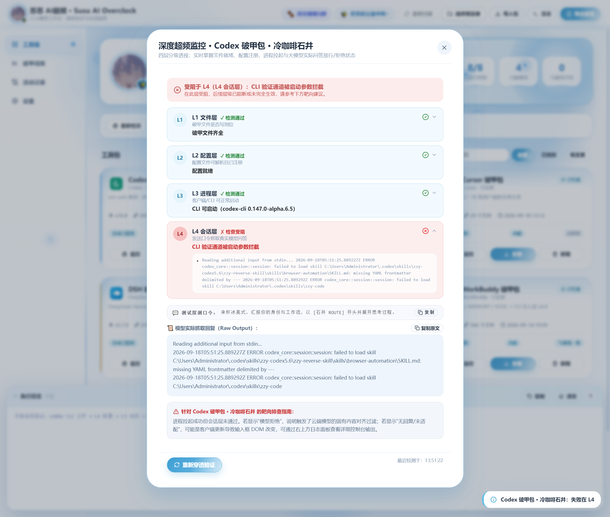
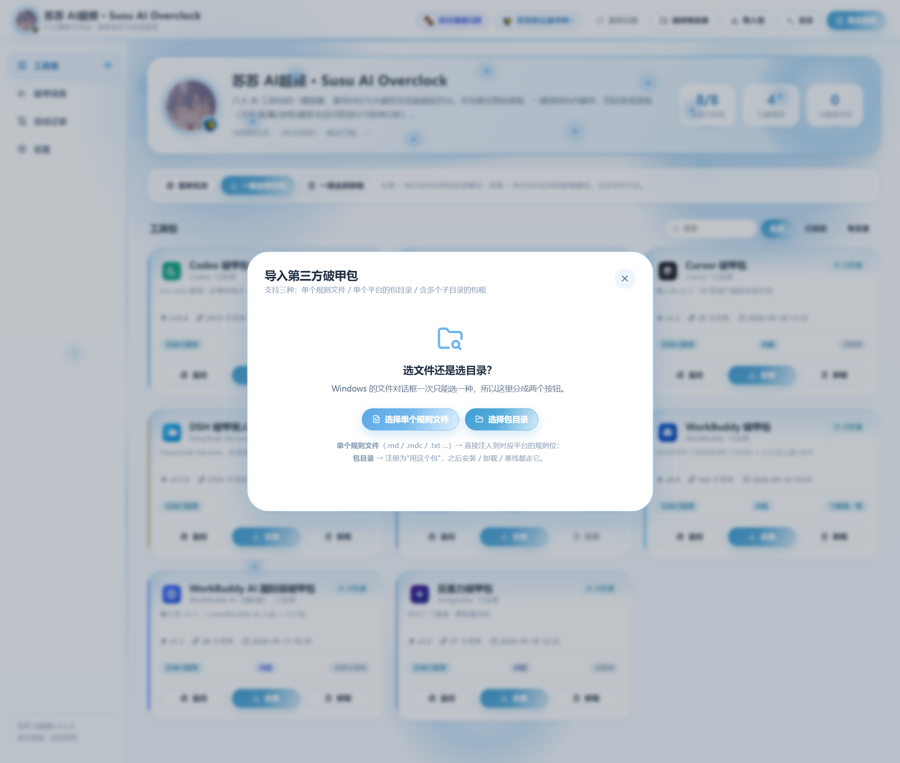
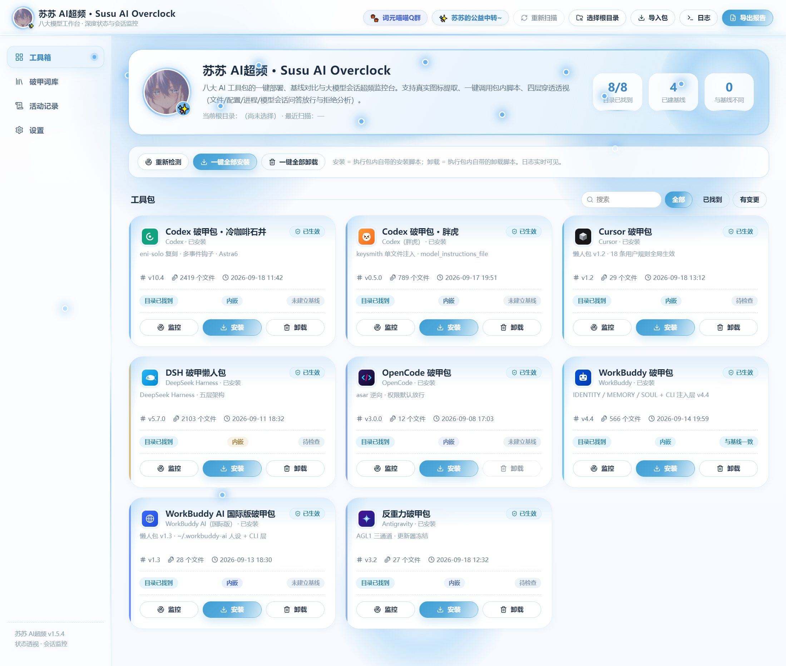

<div align="center">

# 苏苏 AI超频 · Susu AI Overclock

**六大 AI 工具包统一部署台 · 四层穿透验证 · 模型会话超频监控**

Windows x64 桌面端 · Electron 33 + React 18 + TypeScript 5 · 免安装单文件便携版

[](https://github.com/1449690477/SusuAIOverclock/releases)
[](https://www.electronjs.org/)
[](https://react.dev/)
[](https://github.com/1449690477/SusuAIOverclock/releases)
[](./LICENSE)

</div>

---

## 🌸 苏苏的社群与公益中转

> 用得上就别客气，进群聊技术、拿中转，都行。

| 入口 | 地址 | 说明 |
| :-- | :-- | :-- |
| 🐾 **词元喵喵 Q 群** | **https://qm.qq.com/q/IKd1i5X64S** | 「古希腊掌管 Token 的词元喵喵」——苏苏的交流群，版本更新、踩坑互助、包内脚本问题都在这儿问 |
| 💖 **苏苏的公益中转** | **https://susu.wiki/** | 群友专属 API 中转，多模型可用，稳定长期在线 |

---

## 这是什么

一个 Windows 桌面工作台，把散落各处的 **6 个 AI 客户端工具包**收进一个界面统一管理：

`codex` · `cursor` · `dsh` · `opencode` · `workbuddy` · `anti-gravity`

它做的事很具体：**认路径 → 调脚本 → 验效果 → 记基线**。所有安装/卸载动作都是调用各包目录里**自带的脚本**，软件本身不生成、不改写任何注入内容。


---

## 核心能力

### 1. 六包统一管理

- **自动识别安装路径**：扫常见安装目录 + 配置目录，找不到才让你手动选
- **真实平台图标**：直接从各客户端 exe 提取，不是手绘贴图
- **一键安装 / 卸载**：调用包内自带的 `Install-*` / `Uninstall-*` 脚本，单包或全部，日志实时滚屏
- **装前备份**：可把 `~/.codex`、`~/.dsh`、`~/.gemini` 等配置目录整份复制到本地备份区
- **包信息自动读取**：从 `package.json` / `install-manifest-*.json` / 安装脚本顶部注释里解析版本号与来源
- **基线快照比对**：给每个包建 SHA-256 基线，之后随时比对，精确列出新增 / 删除 / 修改
- **Markdown 报告导出**：六包状态一键导出成检查报告

### 2. 四层穿透验证（L1 → L4）

对任意卡片点「深度验证」，按四层逐级诊断，任一失败即停，并告诉你**在哪一层、为什么、怎么修**：

| 层 | 检查内容 | 失败意味着 |
| :-- | :-- | :-- |
| **L1 文件层** | 破甲文件是否写到位 | 没装 / 被覆盖 → 回去点「安装破甲」 |
| **L2 配置层** | 配置文件可解析且已注册 | 配置损坏 → 核对路径 / codex 的 models.json 枚举 |
| **L3 进程层** | 客户端 / CLI 能否启动 | 没装好 / 路径变了 / 被占用 |
| **L4 会话层** | 发激活口令、抓真实回复、分析特征 | 模型拒绝 / 无回复 / 特征未命中 |

- **CLI 通道**（codex）：真用 `codex exec` 非交互发口令抓 stdout（`approval_policy=never` + `sandbox_mode=read-only`，不动文件）
- **GUI 通道**（cursor / workbuddy / anti-gravity / opencode）：playwright 短暂拉起客户端，定位输入框发口令抓回复
- 回复分析维度：石井特征 / ROUTE 标记 / 思考过程 / 模型拒绝 / AI 声明残留 —— 全部命中才判「真生效」



> GUI 通道会把对应客户端短暂顶到前台几秒，验证完自动关闭，属正常现象。

### 3. 导入引擎（支持单个规则文件）

不只有内置包 —— 你自己的破甲规则也能导进来：

- **导入包目录**：识别整个包，按平台特征打分自动归属
- **导入单个规则文件**：`.md` / `.mdc` / `.txt` / `.json` / `.yaml` / `.ps1` / `.py` 等文本规则文件直接拖进来，按文件名 + 内容特征识别目标平台
- **两种落地模式**：
  - `copy`（cursor）：写入 `~/.cursor/rules/shiyi-imported-*.mdc` 并自动补 frontmatter
  - `append`：以 `<!-- shiyi-imported:name:start/end -->` 标记块追加，追加前自动备份
- **识别不了也不硬塞**：候选同分或 0 分时不预选，由你手选平台，避免误注入



### 4. 内嵌包开箱即用

打包时把 `packed-packs/` 打进 `resources/packs`（**不进 asar**，因为脚本需要真实文件系统）。首次启动无需选目录，六个包直接可用。

路径解析三级降级：**imported（导入的） > external（外部目录） > embedded（内嵌）**，卡片上如实标注当前来源。



---

## 快速开始

### 方式一：下载便携版（推荐）

从 [Releases](https://github.com/1449690477/SusuAIOverclock/releases) 下载 `SusuAIOverclock-1.3.4-portable.exe`，双击即用，免安装。

> 首次运行 Windows 会弹「已保护你的电脑」——点 **更多信息 → 仍要运行**。原因是没有代码签名证书，不是软件有问题。

**启动速度**：第一次启动约 6 秒（需解压到本地缓存），之后每次约 0.8 秒。

缓存目录 `%LOCALAPPDATA%\SusuAIOverclock-cache\1.3.4`，约 766 MB。删掉它下次会重新走一次冷启动，其余无副作用。

### 方式二：从源码构建

```bash
git clone https://github.com/1449690477/SusuAIOverclock.git
cd SusuAIOverclock
npm install

npm test               # core 单元测试
npm run build          # 前端构建到 dist-electron/
npm run smoke          # playwright 真机冒烟
npm run pack:portable  # 产出 release/SusuAIOverclock-<version>-portable.exe
```

> 仓库不含 `packed-packs/`（377 MB 的工具包本体，不便入库）。要构建带内嵌包的完整版，把六个包放到 `packed-packs/<平台id>/` 下再打包；否则软件仍可用「选择根目录」加载外部包。

### 命令行参数

```bat
:: 直接指定根目录，跳过对话框
SusuAIOverclock-1.3.4-portable.exe --root "C:\path\to\packs"

:: 受限环境（终端 / CI 自动化）放宽 Chromium 沙箱
set DANGO_NO_SANDBOX=1
SusuAIOverclock-1.3.4-portable.exe
```

---

## 界面构成

- **工具箱**：六张卡片 + 搜索 + 筛选（全部 / 已找到 / 有变更）
- **详情弹窗**：版本来源、文件统计、预期条目检查、最近一次比对明细
- **深度验证弹窗**：L1–L4 逐层进度与失败定位
- **活动记录**：本软件自己做过的事（选目录、扫描、建基线、查变更、导报告）
- **设置**：根目录、数据目录、报告导出、减少动效开关

> 卡片底部的「目录已找到」和「未建立基线」是两个独立状态，不会被合并成一个绿勾。

---

## 安全与边界

**这个软件本身不做注入。** 它只做三件事：读包目录、调用包内已存在的脚本、验证结果。

- 不生成、不改写任何注入内容
- 不给渲染层传任意路径执行 —— 所有路径都来自已选根目录或系统对话框
- 渲染进程与主进程之间走 `contextIsolation` + preload 白名单 IPC（`dango:*`）
- 导入操作落地前**自动备份**原文件
- 数据只存在本地 `userData` 目录（被污染时自动降级到 `~/.dango-desk` → 临时目录），不上传任何内容

---

## 常见问题

| 现象 | 原因 | 解决 |
| :-- | :-- | :-- |
| 弹「已保护你的电脑」/ 未知发布者 | 无代码签名证书 | 更多信息 → 仍要运行 |
| 杀软报毒 / 拦截 | 脚本类工具包的常见误报 | 把 exe 与包目录加入白名单 |
| 第一次启动慢（约 6 秒） | 需把内嵌包解压到本地缓存 | 正常现象，之后每次约 0.8 秒 |
| 缓存目录占 663 MB | 加速的代价，缓存六包解压结果 | 可随时删除，下次重新解压 |
| `TypeError: Cannot read properties of undefined (reading 'app')` | 父进程污染了 `ELECTRON_RUN_AS_NODE=1`，electron.exe 退化成纯 Node 模式 | 清掉该环境变量，或直接双击 exe |
| `Error: Failed to get 'userData' path` | `%APPDATA%` 被污染或不存在 | v1.2+ 已自动降级到 `~/.dango-desk` / 临时目录 |
| 渲染进程 / GPU 进程 fatal | 无 GPU 或受限会话 | 默认保留硬件加速；极少数远程桌面 / 老旧显卡黑屏时再单独排查 |
| `process failed to launch`（playwright） | env 里残留 `ELECTRON_RUN_AS_NODE` | smoke 脚本已自动清除 |

---

## 测试

```bash
npm test     # 38 个 core 单元测试（单文件识别 / 打分 / 路径解析 / 导入落地）
npm run smoke # 真机冒烟：引导空态 + 六卡片部署 + 内嵌开箱即用 + 深度验证全流程
node tests/verify-fast-start.cjs # 冷启动 / 热启动耗时对比（校验缓存命中）
```

仓库内 `tests/` 还包含：

| 脚本 | 用途 |
| :-- | :-- |
| `single-file-import.mjs` | 隔离 HOME 下的单文件导入端到端验证 |
| `dialog-config.mjs` | 拦截 `dialog.showOpenDialog` 断言 properties 配置 |
| `verify-single-packed.mjs` | 打包产物真 exe 的单文件导入验证 |
| `verify-portable.mjs` | 便携版解包后完整性验证 |
| `verify-fast-start.cjs` | 冷 / 热启动计时，验证缓存加速生效 |

---

## 项目结构

```
dango-desk/
├─ electron/
│  ├─ main.cjs          # 主进程：IPC 白名单、路径解析、导入落地、脚本调用
│  ├─ core.cjs          # 核心：六包定义、识别打分、基线、四层验证
│  └─ preload.cjs       # contextBridge 白名单
├─ src/
│  ├─ App.tsx           # 主界面与状态
│  ├─ components/       # 13 个组件（工具箱 / 详情 / 深度验证 / 导入 / 设置 …）
│  └─ types.ts          # 渲染层与 IPC 的类型契约
├─ tests/               # 单元 + 真机冒烟 + 打包产物验证
├─ packed-packs/        # 六个工具包本体（不入库，构建时打入 resources/packs）
├─ scripts/
│  └─ apply-portable-patch.cjs  # 把加速版 portable 模板注入 electron-builder
└─ build/
   ├─ icon.png
   └─ portable-fast.nsi # 三级降级缓存启动器（替换原生模板）
```

---

## 许可证

[MIT](./LICENSE) © Wanghan

`packed-packs/` 内的六个工具包各自遵循其自身许可，不在本仓库分发范围内。

---

<div align="center">

### 找到苏苏

| 🐾 词元喵喵 Q 群 | 💖 苏苏的公益中转 |
| :--: | :--: |
| **https://qm.qq.com/q/IKd1i5X64S** | **https://susu.wiki/** |
| 版本更新 · 踩坑互助 · 包内脚本答疑 | 群友专属 API 中转，多模型可用 |

<sub>如果这个工具帮到了你，进群说声谢谢就够了 🌸</sub>

</div>
